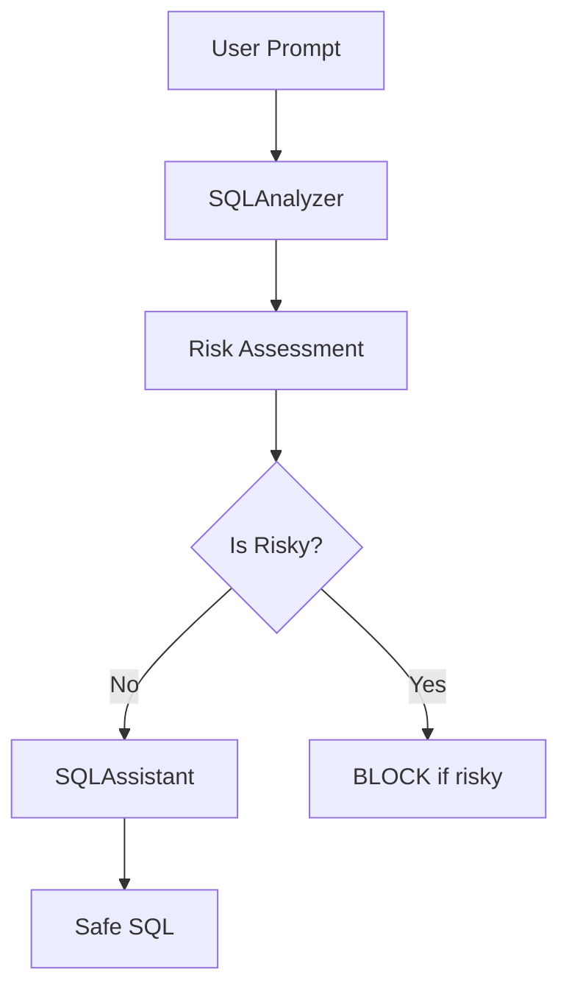

# SQLGuard

A production-ready security guard for AI-powered SQL generation systems. SQLGuard combines pattern matching and LLM-based analysis to prevent malicious SQL queries while allowing legitimate ones.

## Quick Start

1. Set up your environment:
```bash
# Create and activate virtual environment
python -m venv venv
.\venv\Scripts\activate  # Windows
source venv/bin/activate  # Linux/Mac

# Install dependencies
pip install -r requirements.txt
```

2. Set your OpenAI API key:
```bash
$env:OPENAI_API_KEY="your-api-key-here"  # Windows PowerShell
export OPENAI_API_KEY="your-api-key-here" # Linux/Mac
```

3. Run the service:
```bash
bentoml serve service.py:SQLShield
```

The service will be available at http://localhost:3000

## Testing


### Python
```python
# Run test_requests.py
python test_requests.py "Show me the top 5 products by sales"
```

## API Endpoints

- `/analyze`: Analyzes a prompt for security threats
- `/generate`: Generates safe SQL after security analysis

## Architecture



## Security Features

- Pattern matching for known threats
- LLM-based analysis for context-aware security
- Social engineering detection
- Detailed security reasoning
- Safe SQL generation with best practices